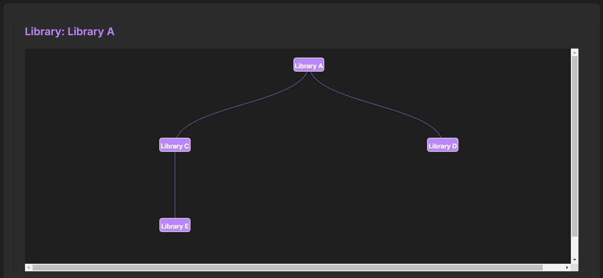
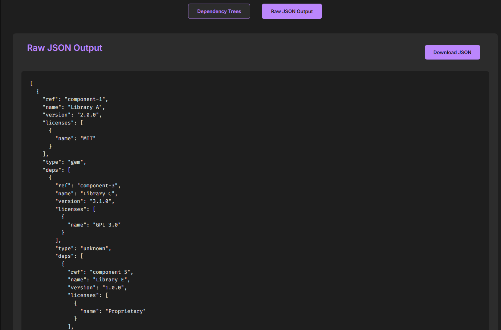
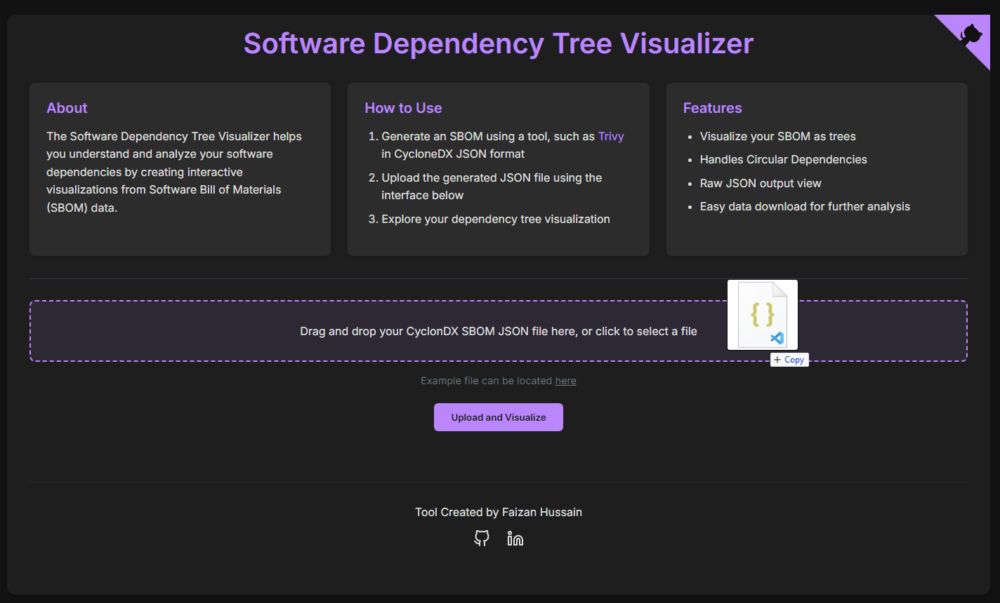
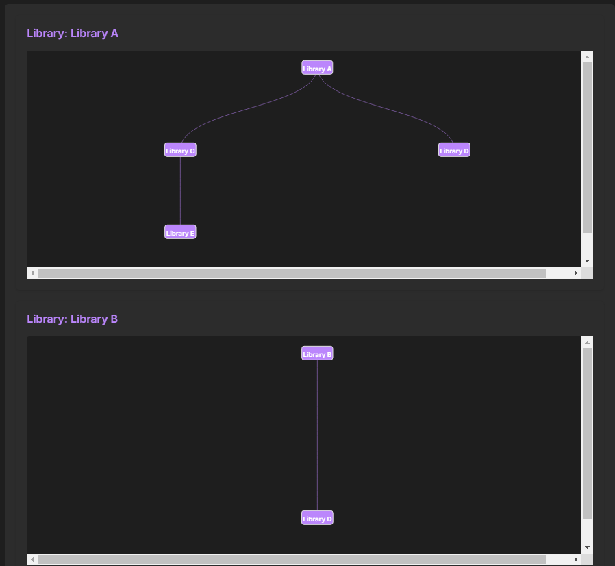

# [Software Dependency Tree Visualizer](https://faizan12123.github.io/Software-Dependency-Tree-Visualizer/)

**Hosted Application URL**: [https://faizan12123.github.io/Software-Dependency-Tree-Visualizer/](https://faizan12123.github.io/Software-Dependency-Tree-Visualizer/)

**Hosted API URL**: [https://dependency-tree-techzon.pythonanywhere.com/api/parse](https://dependency-tree-techzon.pythonanywhere.com/api/parse)

The **Software Dependency Tree Visualizer** is a web-based tool that helps users understand and analyze software dependencies by creating interactive visualizations from Software Bill of Materials (SBOM) data. This application supports visualizing dependency trees, which can be particularly useful in analyzing software dependencies and identifying potential issues such as circular dependencies.

## Table of Contents

- [Photo Gallery](#photo-gallery)
- [Features](#features)
- [How to Use the UI](#how-to-use-the-ui)
- [How to Use the API](#how-to-use-the-api)
- [How to Run the App Locally](#how-to-run-the-app-locally)
  - [Prerequisites](#prerequisites)
  - [Setup](#setup)
- [Contributing](#contributing)
- [License](#license)

## Photo Gallery

Here are some screenshots of the Software Dependency Tree Visualizer in action:

<table>
  <tr>
    <td></td>
    <td></td>
  </tr>
  <tr>
    <td></td>
    <td></td>
  </tr>
</table>


## Features

- **Interactive Dependency Tree Visualization**: Visualize dependencies in an interactive, hierarchical tree structure, making it easy to explore complex relationships between software components.
- **SBOM Upload and Validation**: Users can upload an SBOM in JSON format, with built-in validation to ensure the file meets the size and format requirements.
- **Support for Circular Dependency Detection**: Identifies and marks circular dependencies within the software components to help users address potential issues.
- **Automatic Parsing and Cleaning**: The application parses SBOMs, cleans unnecessary information, and extracts relevant components, ensuring that the visualized data is meaningful.
- **Multiple Root Dependency Visualization**: Supports projects with multiple root nodes, allowing for the visualization of diverse dependency structures.
- **User-Friendly File Upload Interface**: Offers drag-and-drop functionality and an intuitive UI to make uploading and visualizing dependencies as seamless as possible.
- **Rate-Limited API for Parsing**: Provides an API endpoint to programmatically parse and generate hierarchical dependency data, with rate limiting to avoid abuse.
- **Raw JSON Output and Download**: Allows users to view the raw JSON representation of the visualized data and download it for further analysis or reporting.
- **Data Structures and Algorithms**: Uses hierarchical tree data structures to represent dependencies, and employs depth-first search (DFS) for parsing and visualization.
- **JSON Data Sanitization and Error Handling**: Ensures that uploaded JSON files are sanitized, and provides detailed error messages for invalid files or unexpected formats.

## How to Use the UI
Try a testing a sample SBOM file using the "Try Example SBOM File" button or follow these steps to use your own SBOM file:
1. **Generate an SBOM**: Use tools like [Trivy](https://github.com/aquasecurity/trivy) to generate an SBOM in JSON format.
2. **Upload the JSON File**: Drag and drop your SBOM JSON file or click to select a file.
3. **Visualize Dependencies**: The dependency tree will be displayed, providing an interactive way to explore the relationships between components.
4. **View Raw Output**: Switch to the "Raw JSON Output" tab to see the parsed data in JSON format.

## How to Use the API

The application provides an API endpoint for parsing SBOM files.

- **POST /api/parse**
  - **URL**: [https://dependency-tree-techzon.pythonanywhere.com/api/parse](https://dependency-tree-techzon.pythonanywhere.com/api/parse)
  - **Description**: Parses the uploaded SBOM and generates a hierarchical dependency tree.
  - **Request**: Accepts JSON data representing the SBOM.
  - **Response**: Returns a JSON representation of the hierarchical tree.
  - **Rate Limits**: Limited to 10 requests per minute per IP address.

### Example Request

To hit the `/api/parse` endpoint, you can use a tool like `curl` or Postman. Below is an example `curl` command to upload your CycloneDX JSON file:

```sh
curl -X POST https://dependency-tree-techzon.pythonanywhere.com/api/parse \
  -H "Content-Type: application/json" \
  -d @cycloneDX-sbom.json
```

Replace `cycloneDX-sbom.json` with the path to your actual SBOM file. This request will send an SBOM JSON to the `/api/parse` endpoint, and the server will respond with a hierarchical dependency tree.

## How to Run the App Locally


### Prerequisites

- Python 3.8+
- Node.js (for building frontend assets, if needed)

### Setup

1. Clone the repository:
   ```sh
   git clone https://github.com/faizan12123/CycloneDX-SBOM-to-Dependency-Tree-Generator.git
   cd CycloneDX-SBOM-to-Dependency-Tree-Generator
   ```

2. Install Python dependencies:
   ```sh
   pip install -r requirements.txt
   ```

3. Run the Flask application:
   ```sh
   python app.py
   ```

4. Open `index.html` in your browser to use the visualizer.

## Contributing

I welcome contributions to improve the **Dependency Tree Visualizer**. To contribute, please follow these steps:

1. Fork the repository.
2. Create a new branch for your feature or bug fix.
3. Submit a pull request with a detailed description of your changes.

## License

This project is licensed under the MIT License.
